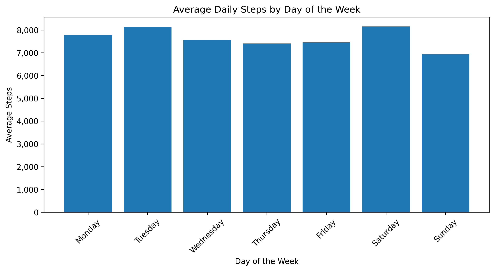
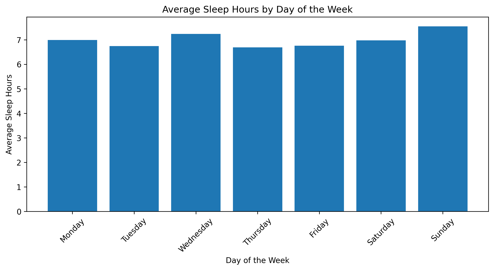
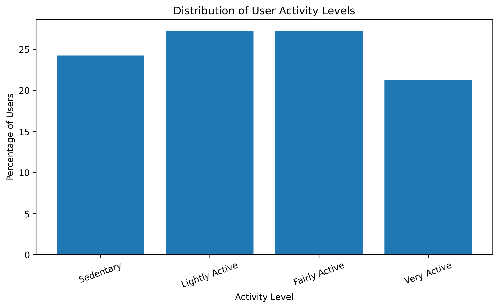
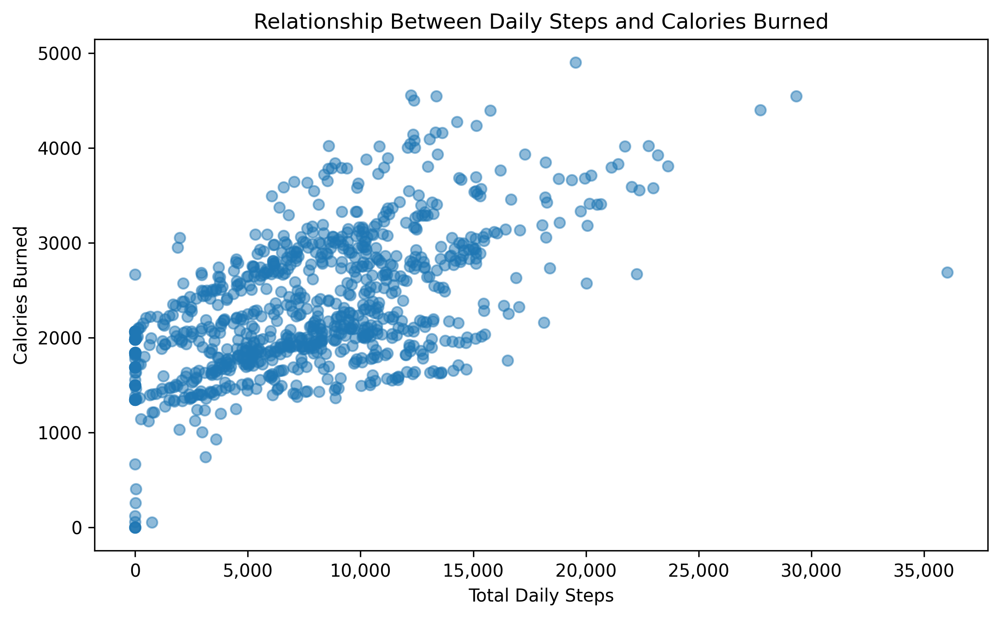
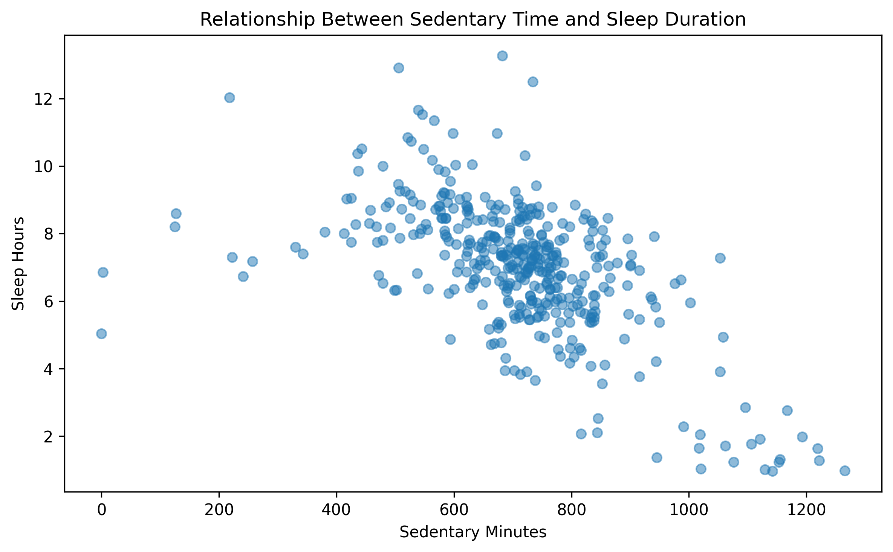
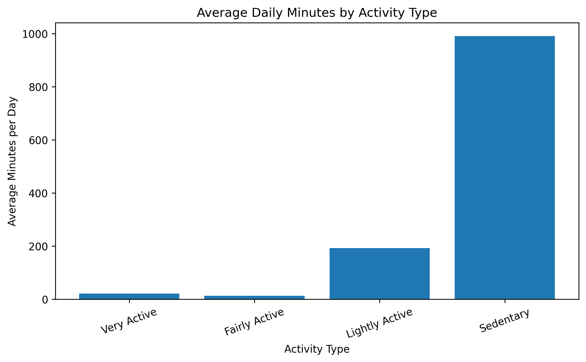

# Bellabeat Product Analysis

## Project Overview

This project analyses Fitbit smart-device data to identify trends in daily activity, sedentary behaviour, sleep, and user engagement.

The findings are applied to the Bellabeat app to support marketing strategies that encourage users to build healthier and more consistent wellness habits.
## Tools Used

- Python
- Pandas
- Matplotlib
- Google Colab
- Microsoft Word
- GitHub
## Key Findings

- Users recorded an average of 7,637.91 steps per day.
- Average sedentary time was approximately 16.5 hours per day.
- Users slept an average of 6.99 hours per night.
- More than half of users were either sedentary or lightly active.
- Daily steps had a moderate positive relationship with calories burned.
- Sedentary time had a moderate negative relationship with sleep duration.
## Recommendations

1. Use personalised and achievable activity goals to support sedentary and lightly active users.
2. Introduce timely movement reminders and short wellness challenges to reduce long periods of inactivity.
3. Combine activity and sleep insights in the Bellabeat app to promote balanced daily routines.
## Project Files

- [View the full case study report](./Bellabeat%20Product%20Analysis%20Case%20Study%20-%20Naa%20Adjeley%20Mensah-Quaye.pdf)
- [View the Python analysis notebook](./Bellabeat_Fitness_Tracker_Analysis_GitHub%20%281%29.ipynb)
## Data Source

This analysis uses the publicly available Fitbit Fitness Tracker Data dataset provided through Kaggle.

The dataset includes activity and sleep records collected from Fitbit users. The original files were not uploaded to this repository because they are publicly available from the source and are not required to understand the analysis.
## Visual Preview

### Average Daily Steps by Day of the Week

### Average Sleep Hours by Day of the Week

### Distribution of User Activity Levels

### Relationship Between Daily Steps and Calories Burned

### Relationship Between Sedentary Time and Sleep Duration

### Average Daily Minutes by Activity Type

